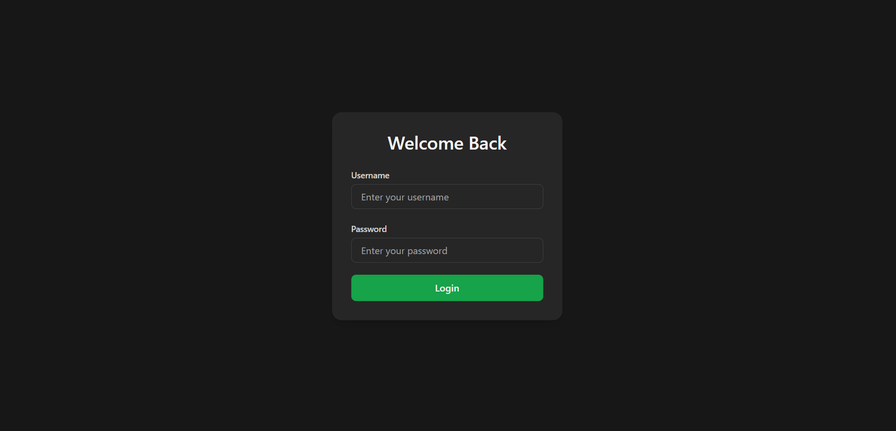

# Borrow Book Monitoring System
An internal web utility system that monitors and tracks who borrowed which book.

## Prerequisites
- Apache
- MySQL Server
I recommend using XAMPP as it comes with built-in Apache for PHP and MySQL Server.

## Previews

**Home Screen**


## Setup
1. Go to you XAMPP htdocs directory (usually in `C:\xampp\htdocs`, depending on where you installed your XAMPP)
2. Clone this repository by running `git clone https://github.com/khianvictorycalderon/Borrow-Book-Monitoring-System.git`
3. Start Apache and MySQL from XAMPP control panel.
4. Go to your phpmyadmin panel, create a database named `borrow_book_monitor_db`, and run this MySQL query:
    ```sql
    
    -- Users table
    CREATE TABLE system_users (
        id INT PRIMARY KEY AUTO_INCREMENT,
        first_name VARCHAR(200) NOT NULL,
        last_name VARCHAR(200) NOT NULL,
        role ENUM('admin', 'moderator', 'staff') NOT NULL DEFAULT 'staff',
        username VARCHAR(200) NOT NULL UNIQUE,
        password VARCHAR(255) NOT NULL,
        created_at TIMESTAMP DEFAULT CURRENT_TIMESTAMP,
        updated_at TIMESTAMP DEFAULT CURRENT_TIMESTAMP ON UPDATE CURRENT_TIMESTAMP
    );

    -- Borrowers table
    CREATE TABLE borrowers (
        id VARCHAR(20) PRIMARY KEY, -- Randomly generated alphanumeric ID (e.g., XXX-XXXX-XXX)
        first_name VARCHAR(200) NOT NULL,
        middle_name VARCHAR(200), -- optional
        last_name VARCHAR(200) NOT NULL,
        description TEXT,         -- optional
        created_by INT NOT NULL,
        created_at TIMESTAMP DEFAULT CURRENT_TIMESTAMP,
        updated_at TIMESTAMP DEFAULT CURRENT_TIMESTAMP ON UPDATE CURRENT_TIMESTAMP,
        FOREIGN KEY (created_by) REFERENCES system_users(id)
    );

    -- Books table
    CREATE TABLE books (
        id INT PRIMARY KEY AUTO_INCREMENT,
        book_name VARCHAR(200) NOT NULL,
        book_author VARCHAR(200) NOT NULL,
        copies_available INT NOT NULL DEFAULT 1,
        created_by INT NOT NULL,
        created_at TIMESTAMP DEFAULT CURRENT_TIMESTAMP,
        updated_at TIMESTAMP DEFAULT CURRENT_TIMESTAMP ON UPDATE CURRENT_TIMESTAMP,
        FOREIGN KEY (created_by) REFERENCES system_users(id)
    );

    -- Borrowed books log table
    CREATE TABLE borrowed_books_log (
        id INT PRIMARY KEY AUTO_INCREMENT,
        book_id INT NOT NULL,
        borrower_id INT NOT NULL,
        logger_id INT NOT NULL,
        borrowed_date TIMESTAMP NOT NULL DEFAULT CURRENT_TIMESTAMP,
        returned_date TIMESTAMP NULL,
        status ENUM('borrowed', 'returned') NOT NULL DEFAULT 'borrowed',
        FOREIGN KEY (logger_id) REFERENCES system_users(id),
        FOREIGN KEY (book_id) REFERENCES books(id),
        FOREIGN KEY (borrower_id) REFERENCES borrowers(id)
    );

    ```
5. Go to your browser and run `localhost/Borrow-Book-Monitoring-System`
6. Enjoy!

## Usage
- The first user of the system will be auto-created on first use, the role would be **Admin**.
- Admin default username is `admin`, and default password is `1234`.
- After first login, change Admin password immediately in account settings!
- Admin can now create moderator and staff accounts!
- All roles can log books, this web system internal project was intended to be used in local network only.

## Roles
- **ADMIN** - Can create moderator and staff account, can modify borrower data, and log borrowed or returned books. (ONE Admin account only!)
- **MODERATOR** - Cannot create moderator and staff account, can modify borrower data, log borrowed or returned books.
- **STAFF** - Cannot create moderator and staff account, cannot modify borrower data, can only log borrowed or returned books.